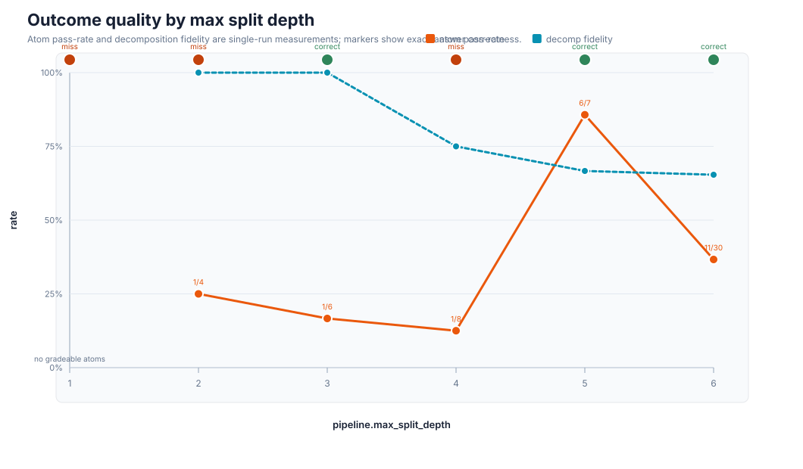
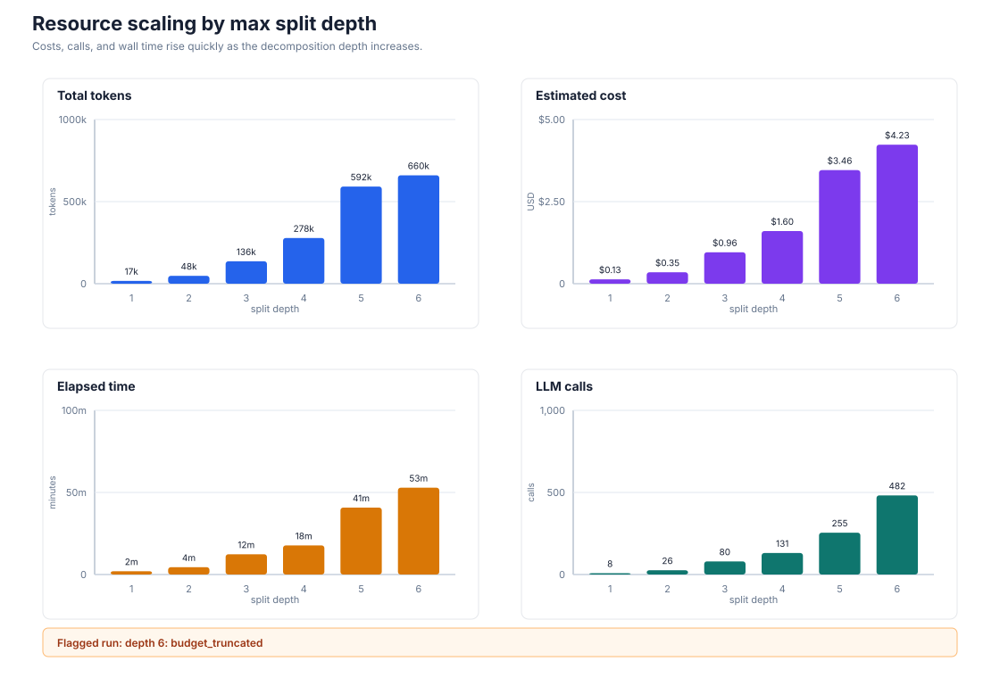
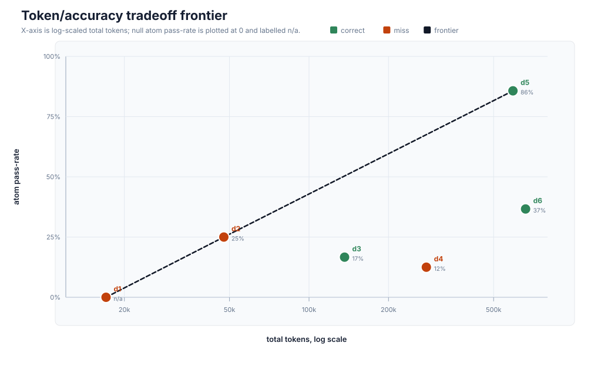
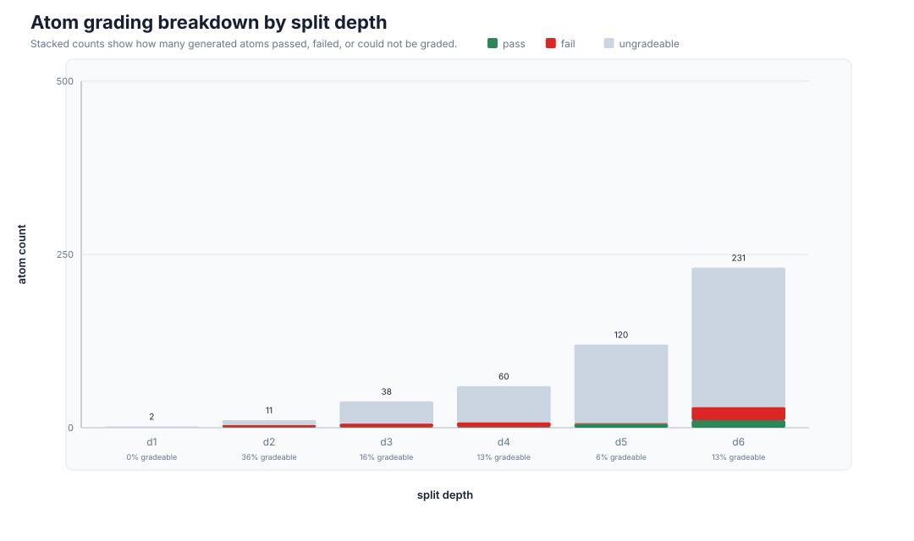
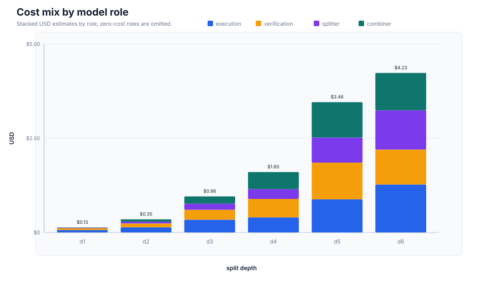
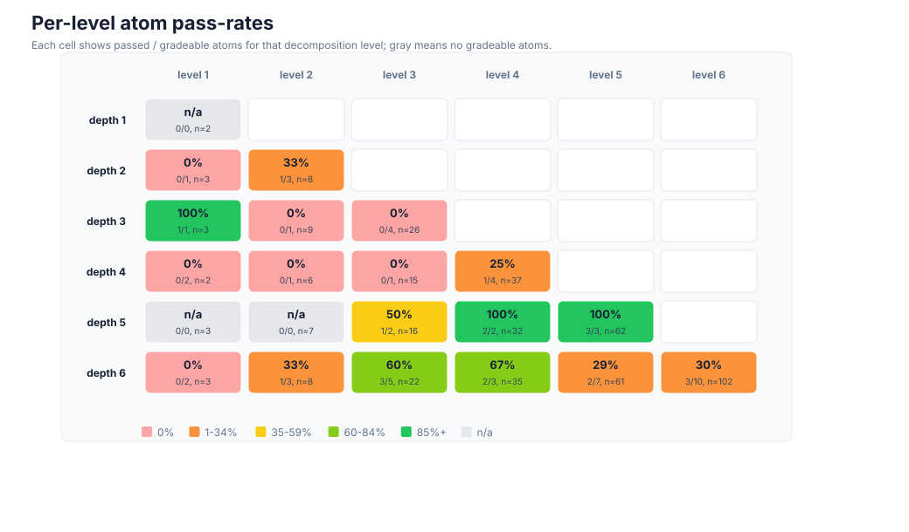

# Chess study plots and key insights

- Source summary: `study_summary.json`
- Source CSV: `study_summary.csv`
- Runs analyzed: 6 single-repeat runs over `pipeline.max_split_depth`.

## Key insights

1. Exact-answer success appeared in 3 of 6 runs. The cheapest correct run was depth 3 at 136,347 tokens, $0.96, and 12.3m.
2. Depth 5 had the strongest atom pass-rate (86%, 6/7 gradeable atoms), but it used 4.3x the tokens and 3.6x the dollars of the depth-3 correct run.
3. Depth 4 is the clearest regression: it spent 278,053 tokens and $1.60 but returned an incorrect FEN, while depth 3 solved the same problem for less.
4. Gradeability is the main bottleneck at deeper splits. Depth 5 left 113/120 atoms ungradeable (94%); depth 6 left 201/231 ungradeable (87%).
5. Depth 6 solved the final answer, but it was flagged `budget_truncated` with only 1 rollout, the highest cost ($4.23), and a lower atom pass-rate (37%) than depth 5.
6. If the target metric is exact final FEN, depth 3 is the cost-conscious baseline. If the target metric is subproblem grading quality, depth 5 is the better candidate to inspect, despite the added cost.

## Plots

### Depth Outcomes

### Resource Scaling

### Token Accuracy Frontier

### Atom Gradeability

### Role Cost Mix

### Level Breakdown

